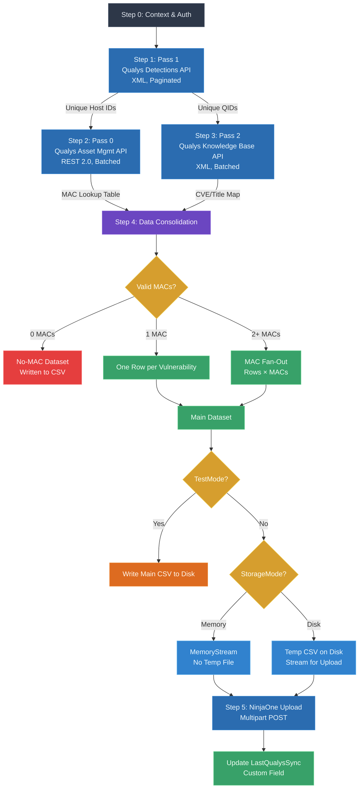

# Qualys to NinjaOne Vulnerability Ingestor

A PowerShell script that synchronizes Qualys vulnerability data to NinjaOne RMM, providing automated vulnerability management integration between the two platforms.

[](https://github.com/PowerShell/PowerShell)
[](https://github.com/dean-johnson/qualys-ninjaone-sync/releases)
[](LICENSE)

## Overview

This script automates the ingestion of Qualys vulnerability detection data into NinjaOne's vulnerability management system. It queries Qualys for active vulnerabilities, enriches the data with CVE information, validates and normalizes MAC addresses for device matching, and uploads the consolidated dataset to NinjaOne.

### Key Features

- **Automated Vulnerability Sync**: Fetches active, new, and re-opened vulnerabilities from Qualys
- **MAC Address Intelligence**: Validates, normalizes, and deduplicates MAC addresses for reliable device matching
- **Multi-MAC Fan-out**: Devices with multiple network interfaces get vulnerability rows per MAC
- **Data Quality Reporting**: Separate CSV outputs for hosts with invalid or missing MAC addresses
- **Flexible Deployment**: Runs in NinjaOne agent context or standalone with environment variables
- **Performance Optimized**: Batch API calls, HashSet deduplication, and memory-efficient processing
- **Dual Storage Mode**: Memory-based or disk-based upload staging
- **Comprehensive Logging**: Timestamped, color-coded logs with configurable verbosity

## Architecture




## Prerequisites

### NinjaOne Custom Fields (Required)

| Field Name | Type | Access | Description |
|------------|------|--------|-------------|
| `QualysImportClientID` | Secure | Read | NinjaOne API OAuth2 Client ID |
| `QualysImportSecret` | Secure | Read | NinjaOne API OAuth2 Client Secret |
| `QualysAPIUser` | Secure | Read | Qualys service account username |
| `QualysAPIPass` | Secure | Read | Qualys service account password |
| `LastQualysSync` | Text/DateTime | Write | Timestamp of last successful sync (auto-populated) |

### Qualys Requirements

- Qualys API access enabled with IP whitelisting
- Service account with vulnerability detection read permissions
- Asset Management API access for MAC address lookups

### NinjaOne Requirements

- API client credentials with `monitoring management` scope
- Vulnerability management module enabled
- Scan group created for Qualys imports

## Installation

1. **Download the script**:
   ```powershell
   Invoke-WebRequest -Uri "https://raw.githubusercontent.com/dean-johnson/qualys-ninjaone-sync/main/QualysVulnImport.ps1" -OutFile "QualysVulnImport.ps1"
Configure NinjaOne custom fields (see Prerequisites above)

Create a NinjaOne script:

Upload QualysVulnImport.ps1 as a script
Assign appropriate role with custom field access
Configure script parameters as needed
Configuration
Script Parameters
Parameter	Type	Default	Description
TestMode	Switch	$true	Skip upload, write CSV to disk for review
EnableDebugLimit	Switch	$false	Limit host count for testing
DebugLimit	Integer	200	Max hosts when debug limit enabled
StorageMode	String	Memory	Upload staging: Memory or Disk
OutputPath	String	C:\WINDOWS\TEMP	Directory for output CSV files
ScanGroupID	String/Int	Global Qualys Import	NinjaOne scan group name or ID
Environment Variables (Standalone Mode)
All configuration can be set via environment variables as an alternative to NinjaOne custom fields:

$env:QualysImportClientID = "your-client-id"
$env:QualysImportSecret = "your-client-secret"
$env:QualysAPIUser = "qualys-username"
$env:QualysAPIPass = "qualys-password"
$env:ScanGroupID = "Global Qualys Import"
$env:TestMode = "false"
copy
Usage
In NinjaOne Agent Context
Create a scheduled task or script in NinjaOne
The script automatically detects agent context and uses custom fields
LastQualysSync custom field is updated after successful upload
Standalone Execution
# Test run with debug limit
.\QualysVulnImport.ps1 -TestMode -EnableDebugLimit -DebugLimit 100

# Production run with disk storage
.\QualysVulnImport.ps1 -TestMode:$false -StorageMode Disk

# Custom output path
.\QualysVulnImport.ps1 -OutputPath "D:\QualysExports" -TestMode:$false
copy
Output Files
All files are written to the configured OutputPath directory:

File Pattern	Description	Uploaded?
qualys_sync_yyyyMMdd-HHmm.csv	Main vulnerability dataset (Device, MAC, CVE, Severity, Title)	Yes
qualys_sync_no_mac_yyyyMMdd-HHmm.csv	Hosts with no valid MAC addresses	No
qualys_sync_invalid_mac_yyyyMMdd-HHmm.csv	Data quality report for malformed MACs	No
Performance
Based on production testing with ~7,500 hosts:

Pass 1 (Detections): ~15 minutes for 7 pages
Pass 0 (MAC Lookup): ~12 minutes for 38 batches
Pass 2 (KB Lookup): ~3 minutes for 33 batches
Consolidation: ~3 minutes for ~275,000 rows
Total Runtime: ~35 minutes
Troubleshooting
Common Issues
"Unable to find the specified field" - Normal for optional config fields without NinjaOne custom field overrides
IP Access Denied (Code 2007) - IP not whitelisted in Qualys; contact Qualys support
LastQualysSync not updating - Ensure custom field exists with Write access for the script role
Upload fails with 404 - Verify scan group ID is correct; check NinjaOne API documentation
Logging
The script provides color-coded, timestamped logging:

Cyan: Section headers
Green: Success messages
Yellow: Warnings and non-fatal issues
Red: Critical errors
Gray/White: Informational messages
Version History
v7.8.0 (Current)
Fixed LastQualysSync field update using Ninja-Property-Set
Unified output path for all CSV files
Added date to output filenames (yyyyMMdd-HHmm)
Configurable output directory
Improved NinjaOne context detection
v7.7.4
Scan group ID auto-resolution from names
API endpoint corrections for current NinjaOne clusters
v7.7.0
Restored critical PowerShell array handling fixes
Enhanced error handling and pagination
Memory/disk storage mode options
Contributing
Contributions are welcome! Please:

Fork the repository
Create a feature branch
Test thoroughly with both test mode and limited datasets
Submit a pull request with detailed description
License
This project is licensed under the MIT License - see the LICENSE file for details.

Author
Dean Johnson

Acknowledgments
Qualys API documentation and support team
NinjaOne API documentation and developer resources
PowerShell community for best practices and optimization techniques
Note: This script requires careful configuration of API credentials and scan groups in both Qualys and NinjaOne. Always test with TestMode enabled before production deployment.


To save this as a file on your system, you can:

1. Copy the entire content above
2. Open Notepad or VS Code
3. Paste the content
4. Save as `README.md` in your script directory

Or use this PowerShell command to create it directly:

```powershell
@'
[paste the markdown content here]
'@ | Out-File -FilePath "C:\path\to\your\script\README.md" -Encoding UTF8
